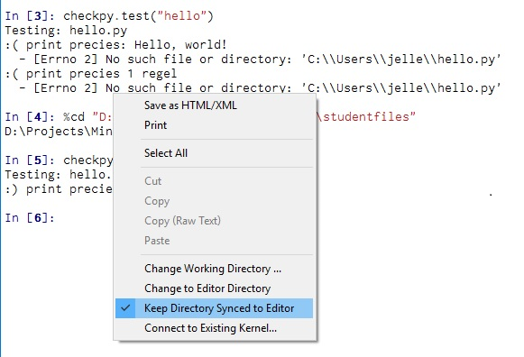
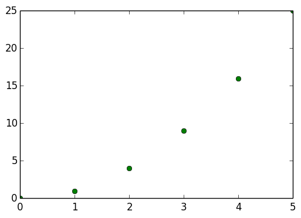
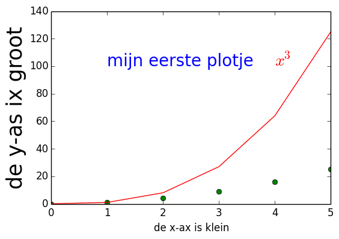
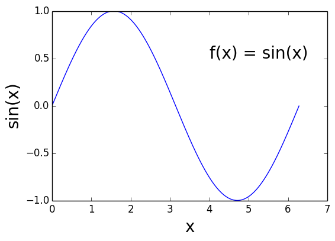
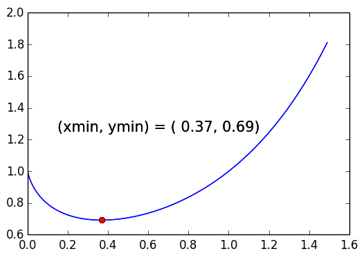

# Module 1: Mario

## tl;dr
* Installeer Python en checkpy
* Test jouw Python en checkpy installatie met `hello.py`
* Controleer je waterverbruik met `water.py`
* Bouw één van Mario's pyramides met `mario.py`
* Reken wisselgeld uit met `greedy.py`
* Plot een grafiek met `grafiek.py`
* Submit!

## Getting Started (Python)

Python is zelf een programma, en moet dus waarschijnlijk nog geïnstalleerd worden op je computer. Wij gebruiken bij deze cursus standaard de *Canopy*-distributie; een pakket met Python en een heleboel handige functies om te hergebruiken. Canopy is gratis voor gebruik in het onderwijs.

Canopy kun je [hier](https://store.enthought.com/downloads/) downloaden. Als het goed is, wordt op de website automatisch de juiste versie voor jouw systeem geselecteerd. Druk op de knop "DOWNLOAD Canopy" om te starten.

- Op *Windows* bestaat de download uit een **.exe**-bestand. Dubbelklik om de installatie te starten. In principe kun je alle standaardopties accepteren, maar [hier](http://docs.enthought.com/canopy/quick-start/install_windows.html) staat nog wat meer uitleg.
  
- Op *Mac* is het een **.dmg**-bestand. Indien nodig, dubbelklik om het te openen. Sleep dan "Canopy" naar *Applications* en start het daarna op om de installatie af te ronden. In principe kun je alle standaardopties accepteren, maar [hier](http://docs.enthought.com/canopy/quick-start/install_macos.html) staat nog wat meer uitleg.

Kijk hier voor meer uitleg over Canopy:


## Getting Started (checkpy)

We gebruiken een programma om te checken of je opdrachten op de juiste manier werken. We vragen je om heel precies te zijn in het geven van de juiste uitvoer!

Om zelf het check-programma te downloaden, moeten we een opdracht invoeren in de "Canopy Command Prompt" of "Canopy Terminal". Deze vind je in de Editor, in het menu genaamd "Tools". Je krijgt een apart scherm waar je commando's kunt intikken. Voer het volgende in:

	pip install checkpy

Je kunt nu de command prompt of terminal weer sluiten. Vervolgens ga je in de Canopy Editor naar de Python Pane, waar je Python-commando's in kunt voeren. Eerst `importen` we checkpy:

	import checkpy

En dan downloaden we éénmalig de checks:

	checkpy.download("https://github.com/Jelleas/progBG2017Tests")

Het checken zelf doe je dan als volgt, bijvoorbeeld om het programma `priem100.py` te controleren:

	checkpy.test("hello")

Ben je klaar met de hele opdracht, check dan nog een keer de hele module:

	checkpy.testModule("module1")

Checkpy is erg streng. Toch is het echt de bedoeling dat je zorgt dat je programma de check door komt. Mocht je niet begrijpen waarom je antwoord wordt afgekeurd, spreek dan meteen een docent aan tijdens het practicum. We kijken dan met je mee.


## What to Do
* Implementeer `hello`
* Implementeer `water`
* Implementeer `mario`
* Implementeer `greedy`
* Implementeer `grafiek`


# Hello

## tl;dr
Implementeer een programma dat een simpele begroeting uitprint als volgt:

```
Hello, world!
```

Voor context zie [wikipedia](https://nl.wikipedia.org/wiki/Hello_world_(programma))


## Specification
Tijd om ons eerste programma te schrijven. Maak via de Canopy editor een nieuwe file aan (ctrl+n of cmd+n) en sla deze in een plek naar keuze op als `hello.py` (ctrl+shift+s of cmd+shift+s). Een tip hierbij is om jouw bestanden op te slaan in Dropbox, zo kun je altijd je bestanden terughalen. Plaats in deze file het volgende stukje Python code:

```
print "Hello, world!"
```

Zie hoe sommige delen van de tekst anders kleuren in de editor. Dit is "syntax highlighting" wat door de editor wordt toegevoegd om stukken code voor jou als programmeur uit te lichten. 

Sla nu je bestand op (ctrl+s of cmd+s), en run deze door middel van de run knop bovenin de editor. Als het goed is zie je nu in de Python terminal de tekst `Hello, world!` staan.


## Testing
Test eerst je programma zelf. Staan er bijvoorbeeld geen extra hoofdletters of missende uitroeptekens in het resultaat?

Ben je tevreden? Test je programma dan met checkpy. Dit doe je door de volgende regels Python code uit te voeren in de Python terminal:

```
import checkpy
checkpy.test("hello")
```

Als je alleen maar happy smileys ziet dan slagen de tests, en kun je nu verder met de volgende opdracht. Slagen ze niet, dan is het tijd om te debuggen. Zie je de volgende error "No such file or directory:", probeer dan eens rechts te klikken de in Python terminal en het volgende aan te vinken:



Was dit niet het probleem? Kijk dan nog eens goed naar je code, staat er bijvoorbeeld geen extra spatie ergens? Kom je er niet uit, tik even een assistent aan!


# Water

## tl;dr

Implementeer een programma dat een gebruiker zijn waterverbruik reporteert, door het aantal minuten douchen te converteren naar flesjes drinkwater.

```
Hoeveel minuten douche je? 1
12

Hoeveel minuten douche je? 10
120
```

## Specification

* Schrijf in een nieuwe file genaamd `water.py` een programma dat de gebruiker vraagt voor de lengte van zijn of haar douche sessie in minuten. Print vervolgens het overeenkomende aantal flesjes water uit. Ga er vanuit dat één minuut douchen overeenkomt met 12 flesjes water (van 0.5L).
* Je mag aannemen dat de gebruiker altijd een positief getal invoert. Je hoeft dus geen fout afhandeling te implementeren mocht de gebruiker dat niet doen.

## Hints

* Maak gebruik van de `input` functie. Deze functie accepteert een argument en print deze uit, vervolgens wacht input tot de gebruiker van jouw programma iets invult en geeft het resultaat daarvan terug. Probeer maar eens `answer = input("Wat is 1 + 2? ")` in de Python terminal.

## Testing
Loop eerst je eigen programma na, werkt deze voor alle legale invoer? Vul bijvoorbeeld eens als aantal douche minuten 0, 10 en 137 in. Lijkt alles te werken, dan is het tijd om checkpy erbij te pakken. Testen gaat net zo als bij `hello`, alleen roep je nu de test voor `water` aan. Zo dus:

```
checkpy.test("water")
```

Mocht je als foutmelding krijgen dat de naam `checkpy` niet bekend is, doe dan eerst even `import checkpy`!


# Mario

## tl;dr
Implementeer een programma dat een halve piramide uitprint van een door de gebruiker gegeven hoogte.

```
Hoe hoog moet de pyramide zijn? 5
    ##
   ###
  ####
 #####
######

Hoe hoog moet de pyramide zijn? 3
  ##
 ###
####
```

## Background
Aan het einde van wereld 1-1 in Super Mario Brothers moet Mario een halve pyramide van blokken beklimmen voordat hij mag springen naar een vlaggenpost. Dit ziet er zo uit:


## Specification

* Schrijf in een bestand genaamd `mario.py` een programma dat de halve pyramide van Mario nabouwt door middel van hashes (`#`).
* Vraag eerst aan de gebruiker de hoogte van de halve piramide. Dit mag enkel een geheel positief getal zijn tussen 0 en 23. (0 en 23 wel, -1, 24 en 176 niet)
* Wanneer de gebruiker een foute hoogte invult vraag je de gebruiker opnieuw naar de hoogte. Net zo lang tot de gebruiker een goede hoogte invult.
* Je mag aannemen dat de gebruiker enkel floats en integer invult.
* Als de hoogte bekend is, genereer dan door middel van `print` en één of meer loops de halve pyramide.
* Let goed op dat er geen spatie tussen de rand van je scherm en de onderste laag van je pyramide staat!

## Hints

* In Python kun je strings vermenigvuldigen door gehele getallen (integers). Probeer maar eens `"Hello" * 3`.
* Tel goed hoe veel spaties en hashes er op elke regel moeten staan.
* Denk goed na over welke loop structuur (`for` en `while`) je wilt gebruiken.
* Deel het probleem op in delen. Zorg bijvoorbeeld eerst dat de gebruiker een getal kan invoeren. Daarna kun je kijken of je kan voorkomen dat de gebruikers foutieve input geeft, en dan de pyramide zelf.
* Kijk ook of de gebruiker geen vreemde waardes invoert als invoer, zoals bijvoorbeeld floats! Je kan kijken of het type van de ingevoerde waarde een integer is door middel van `isinstance`. Probeer bijvoorbeeld maar eens `isinstance(7, int)` en `isinstance("zeven", int)`.

## Testing
Loop weer eerst je eigen programma na. Wat gebeurt er als je 0 voor hoogte invult? Kan je programma alle foute input afhandelen? Ook als de gebruiker als hoogte helemaal geen getal invoert, zoals de string `vijf` bijvoorbeeld? Test dan je programma door middel van checkpy met:

```
checkpy.test("mario")
```


# Greedy

## tl;dr
Implementeer een programma dat het minimaal aantal muntjes uitrekent om wisselgeld te geven. 

```
Hoeveel wisselgeld moet er gegeven worden? 0.41
4
```

## Background


In een ver verleden toen er nog actief werd betaald door middel van contanten was een muntenhouder als hierboven onmisbaar. Het vervelende is dat er voor elk muntje een levertje moest worden ingedrukt, en dit kost tijd. Gelukkig zijn wij er al computer scientists om het aantal terug te geven muntjes te minimaliseren door middel van "greedy algoritmes".

Een greedy algoritme is een algoritme dat altijd de beste lokale keuze maakt op weg naar een antwoord. Alsof je fietst en dan op elk kruispunt de afslag kiest waarvan jij op dat moment denkt dat die zo snel mogelijk leidt tot je eindbestemming. Dit soort algoritmes leiden voor sommige problemen altijd tot een optimale oplossing, maar niet voor alle problemen.

Stel je voor dat een kassière een klant wisselgeld schuldig staat, en dat deze kassière vervolgens op de levertjes kan drukken om kwartjes (25c), dubbeltjes (10c), stuivers (5c), en centen (1c) te krijgen. Een oplossing voor dit probleem is één of meer drukken op de levertjes, en we willen zo min mogelijk levertjes indrukken. Neem een "gierige" kassière die elke keer als hij op een levertje moet drukken, op het levertje drukt met de hoogst mogelijk waarde welke nog gedrukt mag worden. Bijvoorbeeld als een klant nog 41 cent schuldig staat, dan drukt de kassière eerst op het levertje voor een kwartje. Er blijft dan nog (41 - 25 =) 16 cent over. Nu mag de kassière niet meer drukken op het levertje voor een kwartje, want dan zou hij te veel wisselgeld geven. Dus drukt hij voor een dubbeltje, en daarmee blijft er nog 6 cent over. Dit volgt dan met een druk voor een stuiver, en tot slot een cent. In totaal krijgt de klant dus één kwartje, één dubbeltje, één stuiver, en één cent, dit maakt 4 munten in totaal.

Het blijkt dat deze greedy aanpak altijd een optimale oplossing levert voor dit probleem, met deze munten. Natuurlijk aannnemend dat muntstukken nooit opraken. Hoeveel munten er precies nodig zijn? Dat mag jij ons vertellen!

## Specification

* Schrijf in een bestand genaamd `greedy.py` een programma dat eerst vraagt hoe veel wisselgeld er gegeven moet worden, en vervolgens het minimaal aantal munten uitspuwt.
* Ga er vanuit dat de gebruiker een getal als geheel getal (integer), of als komma getal (float) invult. Het getal achter de komma staat dan voor centen. Dus `3.21` betekent 3 dollar en 21 cent.
* Zorg dat als de gebruiker een float heeft ingevuld, je hiervan een integer maakt. Floating points hebben kleine precisie fouten, en dat wil je niet als je met geld werkt! Je kan door middel van de functie `int` een float converteren naar een integer. Probeer maar eens `int(7.3)` en `int(7.8)`.
* [Slaagt de gebruiker er niet in om correcte input te geven](https://en.wikipedia.org/wiki/Murphy's_law), laat het de gebruiker dan opnieuw proberen.

## Hints

* Vergeet het deel achter de komma niet als je converteert naar een integer!
* Hoe je dit probleem aanpakt is aan jou. Je zou bijvoorbeeld loops kunnen gebruiken of gebruik kunnen maken van de modulo operator `%`. Probeer maar eens `26 % 8`.

## Testing

```
checkpy.test("greedy")
```


# Grafiek

## Functies importeren

Je hebt in de vorige opgaven al kennis gemaakt met enkele ingebouwde functies van Python zoals `input` en `isinstance`. Er zijn nog heel veel andere *functies*, maar die zijn niet standaard beschikbaar.

Voor het uitrekenen van de sinus van een getal is de functie `sin` beschikbaar. Maar als je in Python `sin(1.0)` opvraagt, dan verschijnt er een foutmelding:

```
Traceback (most recent call last):
  File "<stdin>", line 1, in <module>
NameError: name 'sin' is not defined
```

Het gaat om de laatste regel van die foutmelding. Deze is in zo normaal mogelijk Engels geformuleerd en redelijk te begrijpen: Python kent de naam `sin` niet en kan er dus niks mee!

Om gebruik te maken van de `sin`-functie moet je zorgen dat de `math`-bibliotheek en alle functies daarin beschikbaar worden in jouw programma:

```
import math
x = 0.5
print math.sin(x)
```

Als je de functie `sin()` wilt gebruiken moet je nou eenmaal de bibliotheek waarin de functie staat importeren. De functies die beschikbaar zijn in de math library kan je vinden in de [documentatie](https://docs.python.org/2/library/math.html). Zo zijn er [nog meer libraries](https://docs.python.org/2/library/) die standaard worden meegeleverd met Python.

## Numpy

Een voorbeeld van een uitgebreidere wiskundebibliotheek is de `numpy`-library. Documentatie en voorbeelden kan je vinden op <http://www.numpy.org>. We noemen meteen een handige functie die we in deze cursus een paar keer zullen gebruiken: `arange`.

Van de `for`-loops ken je nog de functie `range`. Dit is een functie die reeksen opeenvolgende nummers genereert. Zo zijn deze twee stukken code equivalent:

```
# versie 1
for i in range(1,10):
    print i

# versie 2
for i in [1,2,3,4,5,6,7,8,9]:
    print i
```

Nu werkt deze `range` functie alleen met gehele getallen. In wiskundige toepassingen willen we vaak veel kleinere stapjes nemen. Met behulp van `numpy.arange()` kan dat net zo makkelijk als met gehele getallen:

```
    import numpy
    
    for x in numpy.arange(2.0, 9.0, 0.1):
        print x
```

## Plotten

Het is vaak handig om je resultaten te visualiseren in een grafiek of door middel van een animatie. Dit is belangrijk om je resultaten inzichtelijk te maken, maar ook tijdens het ontwikkelen van (lees 'vechten met') je code. Tijdens het programmeren loop je vaak tegen problemen waarbij de computer niet lijkt te doen wat jij wilt. Dit zogenaamde debuggen, het uitzoeken waar je programa een andere lijn volgt dan de logica die jij erin denkt te hebben gestopt, gebeurt vaak door op bepaalde plekken iets te printen. Een alternatief is het visualiseren van de data uit je programma, omdat je dan in één oogopslag ziet waar het probleem zit.

Om je boodschap en conclusies goed over te brengen is het belangrijk dat je aandacht besteedt aan de presentatie zodat het voor je publiek duidelijk is. Neem dus de tijd om de bijbehorende grafiek netjes en duidelijk te maken.

Er is een module om resultaten te visualiseren in Python: `matplotlib`. Het is een zeer omvangrijke module waarvan we maar een fractie nodig zullen hebben. Een goede tutorial kan je [hier](http://matplotlib.org/users/pyplot_tutorial.html) vinden.

> Er bestaat een enorme variatie in de manier waarop data en resultaten gevisualiseerd worden. Denk altijd na hoe *jij* denkt dat je het best de informatie weer kan geven zodat de *gebruiker* de juiste conclusie trekt. Zoek vervolgens in de `matplotlib`-documentatie hoe je dat voor elkaar kunt krijgen.

Hieronder drie voorbeelden waarmee je de basis van `matplotlib` leert kennen. In de opgave hieronder ga je dit gebruiken. Vergeet niet de voorbeelden uit te proberen!

## Een lijst met punten

We beginnen met het plotten van wat punten waarvan we de x-waardes (0,1,2,3,4,5) en de y-waardes (0,1,4,9,16,25) hebben. In dit geval is het precies de functie x-kwadraat, maar dat hoeft natuurlijk niet. Om daar een grafiek van te maken doen we het volgende:

```
import matplotlib.pyplot

# de coordinaten per punt
x_coords = [0,1,2,3,4,5]
y_coords = [0,1,4,9,16,25]

# plot punten (y tegen x) met groene rondjes
matplotlib.pyplot.plot(x_coords, y_coords, "go")
matplotlib.pyplot.show()
```

Hierbij is ervoor gekozen om de 'marker' (figuur waarmee elk punt weergegeven wordt) weer te geven als een groen rondje door middel van het meegeven van `"go"`. 



## Afkorten

Om lange regels te voorkomen kun je een lange modulenaam ook een kortere naam geven bij het importeren.

```
# gebruik de afkorting 'plt'
import matplotlib.pyplot as plt

# de coordinaten per punt
x_coords = [0,1,2,3,4,5]
y_coords = [0,1,4,9,16,25]

plt.plot(x_coords, y_coords, "go")
plt.show()
```

## Meerdere grafieken en bijschriften

En natuurlijk horen er labels bij de assen, kan je 2 verschillende grafieken in 1 plot zetten en kan je zelf tekst weergeven. Om ook de grafiek x^3 in de grafiek te zetten (met rode lijnen) doe je het volgende:

```
import matplotlib.pyplot as plt

x_values  = [0,1,2,3,4,5]
x_squared = [0,1,4,9,16,25]
x_cubed   = [0,1,8,27,64,125]

# let op: grafiek met twee datasets!
plt.plot(x_values, x_squared, "go", x_values, x_cubed, "r-")

plt.xlabel("de x-ax is klein")
plt.ylabel("de y-as ix groot", fontsize = 25)

plt.text(1.00,100., "mijn eerste plotje", color = "blue", fontsize = 20)
plt.text(4.00,100., "$x^3$", color = "red", fontsize = 20)

plt.show()
```



> Tip: de formule $$x^3$$ kunnen we mooi afdrukken bij de grafiek omdat we in pyplot *LaTeX* mogen gebruiken. Helaas kan dat alleen in plotjes!

## Hoge resolutie grafieken

In stap 2 hebben we een klein aantal punten gekozen waarbij je de waardes zelf in moet vullen. De grafiek ziet er dan ook niet bepaald mooi uit. Je kan natuurlijk met de computer ook zelf x-waardes en bijbehorende y-waardes berekenen. Bijvoorbeeld om de functie sin(x) te plotten in stapjes van 0.01 tussen 0 en 2*pi knopen we de verschillende dingen die we dit blok geleerd hebben aan elkaar en doen we het volgende:

```
import numpy as np
import math
import matplotlib.pyplot as plt

x_values = []   # lijst met x-waardes
y_values = []   # lijst met y-waardes

# x loopt van 0 tot 2pi in stapjes van 0.01
for x in np.arange(0, 2*math.pi, 0.01):
    # bereken bijbehorende y-waarde voor elke x
    y = math.sin(x)
    
    # voeg data toe aan de lijsten
    x_values.append(x)
    y_values.append(y)

# teken de hele grafiek
plt.plot(x_values, y_values, "b-")
plt.xlabel("x", fontsize = 20)
plt.ylabel("sin(x)", fontsize = 20)
plt.text(4.00, 0.50, "f(x) = sin(x)", color = "black", fontsize = 20)
plt.show()
```



## Specification

* Laten we beginnen, maak een file `grafiek.py` en schrijf daarin een programma dat de grafiek van de functie $$f(x) = x^x$$ tussen x = 0 en x = 1.5 in stapjes van 0.01 plot. Gebruik hiervoor een blauwe lijn.
* Zorg dat het minimum in de grafiek wordt aangegeven door middel van een rode stip.
* Laat je programma uitprinten, in de Python terminal, waar dit minimum zich bevindt.



## Hints

* Kijk goed naar de voorbeelden.
* Google is je vriend.

## Testing
Testen is voor deze opdracht wat lastiger, want checkpy kan niet je grafiek beoordelen. Of deze grafiek correct is moet je dus zelf nagaan. Checkpy kan wel testen of je een grafiek maakt, en of de gevonden minpunten kloppen.

```
checkpy.test("grafiek")
```

# Have a cookie

